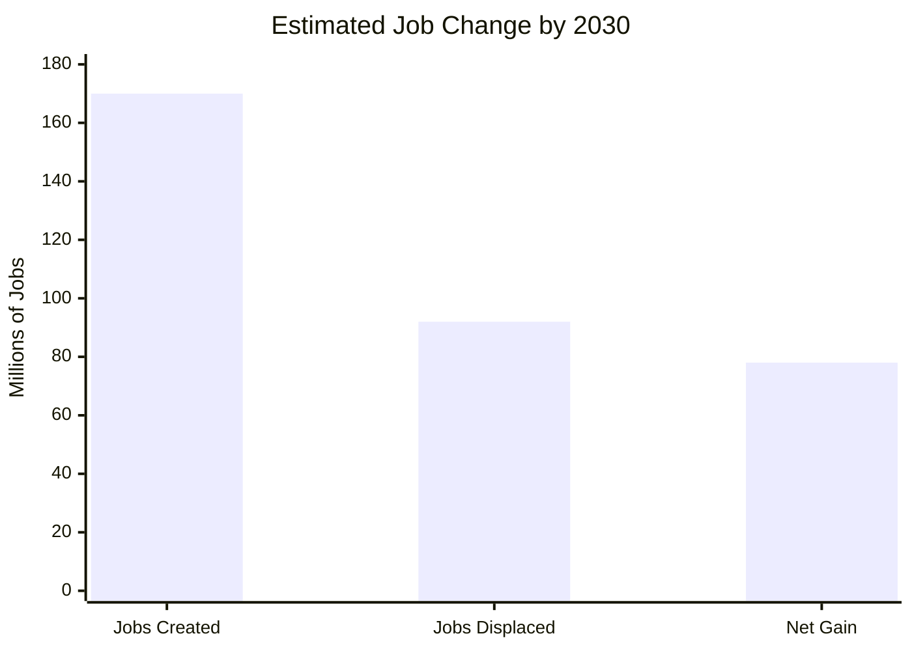
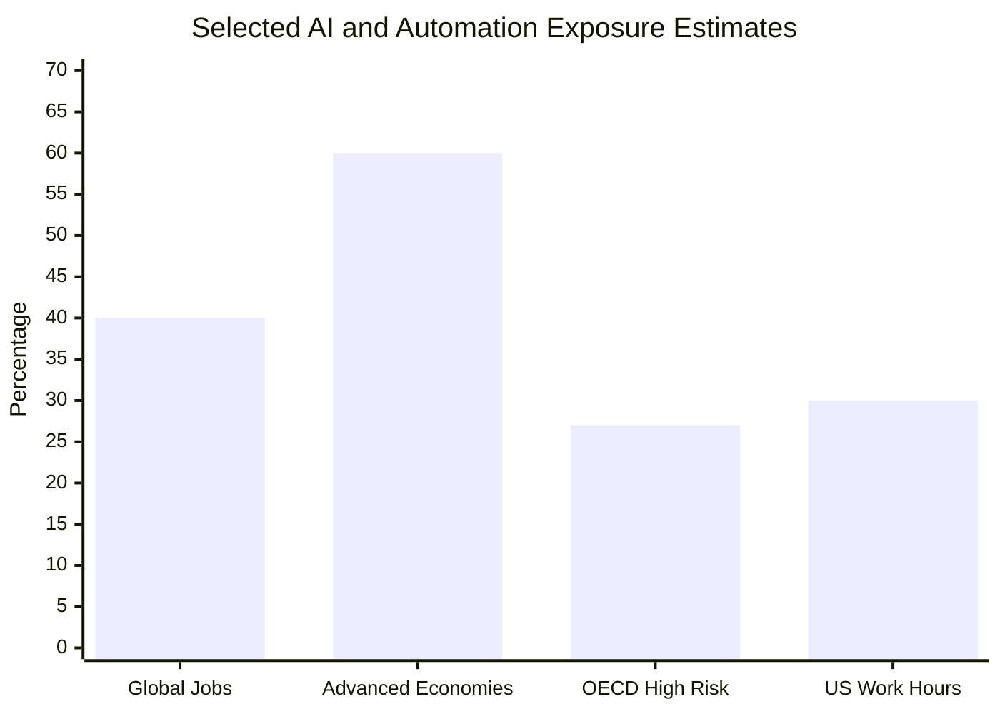
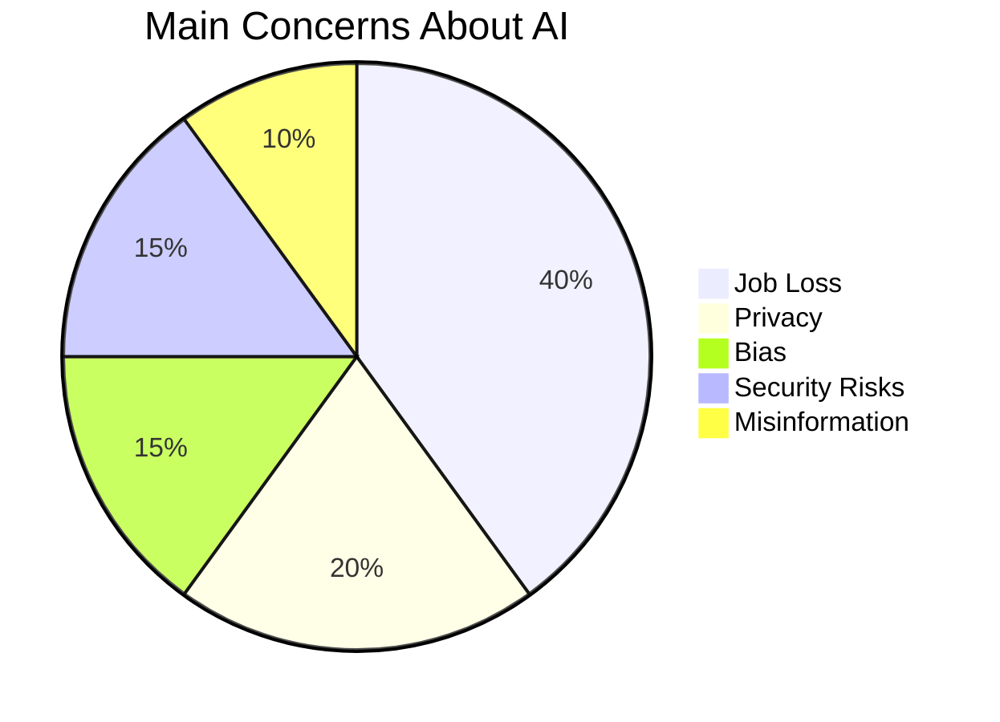
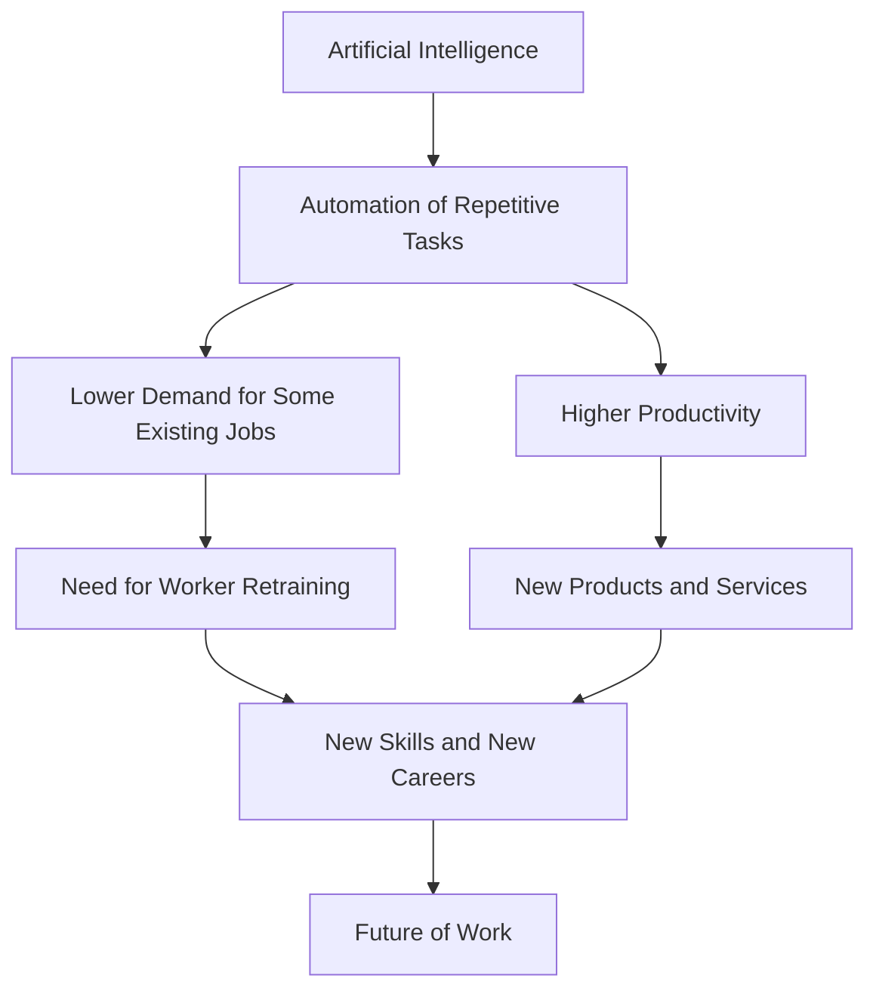

# The Impact of Artificial Intelligence on Employment, Job Creation, and the Future of Work

## Project Information

| Item            | Information                                                                               |
| --------------- | ----------------------------------------------------------------------------------------- |
| University Name | Ilia State University                                                                     |
| Course Name     | Artificial Intelligence                                                                   |
| Project Title   | The Impact of Artificial Intelligence on Employment, Job Creation, and the Future of Work |
| Team Members    | Aykhan Mammadov                                                                           |
| Date            | 19 June 2026                                                                              |

---

## Table of Contents

1. Introduction
2. What Artificial Intelligence Means in Employment
3. Jobs and Tasks Most Exposed to AI
4. Job Creation and New Opportunities
5. Social and Ethical Concerns
6. Visualizations and Analysis
7. Future of Work
8. Conclusion
9. References

---

# 1. Introduction

Artificial Intelligence, usually called AI, is one of the most important technologies of the modern world. AI systems are already used in education, transportation, medicine, finance, engineering, communication, and business. Many companies use AI to analyze data, automate tasks, answer customer questions, support decision making, and reduce the time needed to complete routine work.

The development of AI has created both excitement and fear. On one side, AI can improve productivity, reduce human error, and help people complete difficult tasks faster. On the other side, AI may replace some human workers, especially in jobs that are repetitive, predictable, or based mainly on processing information.

The main question of this report is not simply whether AI will destroy jobs. A more accurate question is: **how will AI change work?** In many cases, AI does not replace an entire profession immediately. Instead, it replaces or assists with specific tasks inside a job. For example, an accountant may use AI to prepare reports faster, but a human may still be needed to check the result, communicate with clients, and make final decisions.

This report discusses how AI affects employment, what types of jobs are most exposed to automation, what new opportunities AI can create, and what ethical problems society must consider. The report also includes visualizations to show the relationship between AI, job displacement, job creation, and the need for worker retraining.

---

# 2. What Artificial Intelligence Means in Employment

Artificial Intelligence is a field of computer science that focuses on creating systems that can perform tasks usually requiring human intelligence. These tasks may include learning from data, recognizing patterns, understanding language, making predictions, solving problems, and generating text or images.

In the workplace, AI can be used in many different ways. Some AI systems are designed to replace repetitive tasks, while others are designed to assist human workers. For example, a customer service chatbot can answer simple questions, while a human worker handles more complex or emotional cases. In medicine, AI can help doctors analyze medical images, but doctors are still responsible for diagnosis and treatment decisions.

Because of this, it is better to think about **task automation** instead of only **job automation**. A job usually contains many tasks. Some tasks can be automated, while others still require human judgment, creativity, communication, or responsibility.

For example:

| Job                     | Tasks AI Can Support                    | Tasks Humans Still Do Better           |
| ----------------------- | --------------------------------------- | -------------------------------------- |
| Teacher                 | Preparing quizzes, summarizing texts    | Motivating students, emotional support |
| Engineer                | Simulation, calculations, documentation | Design judgment, safety decisions      |
| Doctor                  | Image analysis, patient data review     | Diagnosis responsibility, empathy      |
| Customer Support Worker | Answering common questions              | Handling angry or complex customers    |

This shows that AI does not always remove the human role completely. Instead, it changes the skills workers need.

---

# 3. Jobs and Tasks Most Exposed to AI

Some jobs are more exposed to AI than others. Jobs involving repetitive information processing, routine decision making, or predictable actions are usually more vulnerable. This includes areas such as data entry, basic customer support, cashier work, translation, simple accounting, and administrative assistance.

AI can complete many of these tasks quickly because they follow patterns. For example, if a company receives thousands of similar customer questions, an AI chatbot can answer many of them automatically. If a worker spends hours entering information into forms, AI tools can reduce or remove that work.

However, exposure to AI does not always mean that the job will disappear. It may mean that the job will change. Workers may need to learn how to use AI tools rather than compete against them. A person who understands both their profession and AI tools may become more productive than someone who refuses to adapt.

According to international labor-market reports, many jobs will be affected by AI and automation. The World Economic Forum estimated that by 2030, large labor-market changes may create millions of new jobs while also displacing millions of existing jobs [1]. The IMF has also warned that a large share of global employment is exposed to AI, especially in advanced economies [2].

The most exposed jobs are usually those that depend heavily on routine cognitive or repetitive tasks. These may include:

* Data entry clerks
* Administrative assistants
* Cashiers
* Basic customer service workers
* Some accounting and bookkeeping roles
* Content moderation workers
* Repetitive factory roles
* Basic translation and writing tasks

The risk is not the same in every country. Developed economies may have more office-based and digital jobs exposed to AI. Developing economies may be affected more slowly, but they may also have fewer resources for retraining workers.

---

# 4. Job Creation and New Opportunities

Although AI can replace some jobs, it can also create new ones. This has happened before with previous technologies. For example, the internet reduced some traditional jobs but created new careers in web design, cybersecurity, digital marketing, e-commerce, and software development.

AI may create jobs in areas such as:

* AI system development
* Machine learning engineering
* Data science
* Robotics
* Cybersecurity
* AI ethics
* AI law and regulation
* AI-assisted education
* Human-AI interaction design

Even non-programmers may benefit from AI skills. Many future workers may not need to become AI engineers, but they may need to know how to use AI tools responsibly. For example, a student may use AI to summarize material, an engineer may use AI to prepare documentation, and a manager may use AI to analyze business reports.

The World Economic Forum estimated that future labor-market transformation may create more jobs than it removes by 2030, but this positive result depends heavily on education and reskilling [1]. If workers are not trained for new roles, job displacement can still become a serious social problem.

This means that schools, universities, governments, and companies have an important responsibility. They must help people learn new skills instead of leaving them behind.

Important future skills may include:

| Skill             | Why It Matters                              |
| ----------------- | ------------------------------------------- |
| Digital literacy  | Workers need to understand basic technology |
| Critical thinking | AI outputs can be wrong and must be checked |
| Communication     | Human interaction remains important         |
| Creativity        | AI can assist, but humans still guide ideas |
| Ethics            | AI must be used responsibly                 |
| Adaptability      | Workers must adjust to changing tools       |

AI may not remove the need for humans, but it may increase the need for educated and adaptable humans.

---

# 5. Social and Ethical Concerns

AI creates several important ethical and social concerns. The first major concern is unemployment. If companies use AI mainly to reduce labor costs, some workers may lose their jobs. This can create stress, poverty, and social inequality.

The second concern is inequality. Highly educated workers may benefit from AI because they can use it to become more productive. However, workers with fewer digital skills may be pushed out of the labor market. This may increase the gap between rich and poor people.

The third concern is privacy. AI systems often depend on large amounts of data. If companies collect too much personal information, people may lose control over their privacy. AI can also be used for surveillance in workplaces, such as monitoring worker performance too closely.

Another concern is bias. AI systems learn from data, and if the data contains unfair patterns, the AI may repeat those patterns. For example, an AI hiring system may unfairly reject certain applicants if its training data reflects past discrimination.

There is also the issue of responsibility. If an AI system makes a wrong decision, it can be difficult to know who is responsible: the programmer, the company, the user, or the AI system itself. This is especially important in areas such as medicine, transportation, law, and engineering.

Main ethical concerns include:

* Job displacement
* Income inequality
* Privacy loss
* Algorithmic bias
* Dependence on technology
* Lack of transparency
* Responsibility for AI mistakes

AI should therefore be developed carefully. It should not only be judged by efficiency and profit. It should also be judged by its effect on people and society.

---

# 6. Visualizations and Analysis

## 6.1 Jobs Created and Displaced by 2030

The following visualization is based on World Economic Forum estimates about future labor-market change by 2030.

**Figure 1:** Estimated job creation, displacement, and net gain by 2030.

This chart shows that AI and other economic changes may remove many jobs, but they may also create many new ones. The important issue is whether workers can move from declining jobs into growing jobs.

---

## 6.2 Estimated Exposure to AI and Automation

Different organizations measure AI exposure differently. Some measure jobs, while others measure tasks or work hours. The following chart compares selected estimates.

**Figure 2:** Selected estimates of AI and automation exposure.

This chart shows that exposure to AI is significant. However, exposure does not always mean full replacement. In many cases, workers may use AI as a tool instead of being fully replaced by it.

---

## 6.3 Main Social Concerns About AI

The following pie chart summarizes common public concerns about AI.

**Figure 3:** Main social concerns related to AI.

Job loss is one of the most common concerns because employment directly affects people’s income and stability. However, privacy, bias, security, and misinformation are also serious problems.

---

## 6.4 AI Impact Flow Diagram

**Figure 4:** Relationship between AI, automation, retraining, and the future of work.

This diagram shows that AI affects employment in more than one direction. It can reduce demand for some jobs, but it can also improve productivity and create new work opportunities. The key connection is retraining.

---

# 7. Future of Work

The future of work will probably not be a world where humans do nothing and machines do everything. A more realistic future is one where humans and AI work together. AI will handle many repetitive or data-heavy tasks, while humans will focus more on judgment, creativity, responsibility, communication, and ethical decision making.

For workers, this means that education must change. It is no longer enough to learn only one skill and use it for an entire lifetime. Workers may need to update their knowledge many times during their careers.

For universities, this means that AI literacy should become part of many programs, not only computer science. Engineering students, business students, medical students, and social science students may all need basic knowledge of AI tools and their limitations.

For governments, the main challenge is protecting workers during the transition. This can include retraining programs, unemployment support, digital education, and rules about responsible AI use.

For companies, the challenge is using AI ethically. Companies should not only use AI to remove workers quickly. They should also help employees learn how to work with AI systems.

Human abilities that will remain important include:

* Creativity
* Leadership
* Emotional intelligence
* Ethical thinking
* Teamwork
* Complex problem solving
* Responsibility for final decisions

AI can generate answers, but humans must still decide whether those answers are correct, fair, and useful.

---

# 8. Conclusion

Artificial Intelligence is transforming employment and society. It can automate tasks, increase productivity, and create new opportunities. At the same time, it can cause job displacement, inequality, privacy problems, and ethical concerns.

The strongest conclusion is that AI is neither completely good nor completely bad. Its effect depends on how people, companies, universities, and governments choose to use it. If AI is used only to reduce costs, it may harm many workers. If it is combined with education and retraining, it may help create a more productive and advanced society.

The future of work will require adaptation. Workers must learn new skills, universities must modernize education, and governments must prepare policies for responsible AI use. AI will not remove the importance of humans. Instead, it will change what kinds of human skills are most valuable.

In the end, the best solution is not to reject AI, but to use it wisely. Society should prepare people to work with AI instead of being replaced by it.

---

# 9. References

[1] World Economic Forum. *The Future of Jobs Report 2025*. World Economic Forum, 2025.

[2] International Monetary Fund. *AI Will Transform the Global Economy. Let’s Make Sure It Benefits Humanity*. IMF Blog, 2024.

[3] Organisation for Economic Co-operation and Development. *OECD Employment Outlook 2023*. OECD, 2023.

[4] McKinsey Global Institute. *Generative AI and the Future of Work in America*. McKinsey & Company, 2023.

[5] International Labour Organization. *Generative AI and Jobs: A Global Analysis of Potential Effects on Job Quantity and Quality*. ILO, 2023.
